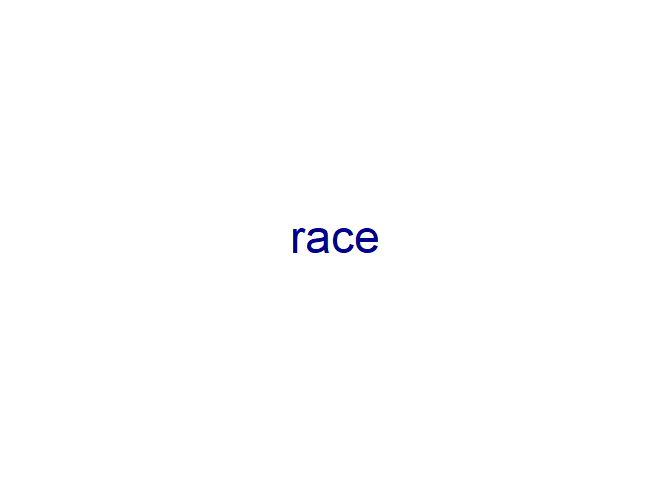

XX
================
Your Name
2024-10-XX

``` r
library(haven)
library(quanteda)
```

    ## Warning: package 'quanteda' was built under R version 4.3.3

    ## Package version: 4.1.0
    ## Unicode version: 15.1
    ## ICU version: 74.1

    ## Parallel computing: 12 of 12 threads used.

    ## See https://quanteda.io for tutorials and examples.

``` r
library(quanteda.textplots)
```

    ## Warning: package 'quanteda.textplots' was built under R version 4.3.3

``` r
rep_text <- read.csv("C:/Users/Colin/Downloads/rep_text.csv")
```

``` r
corp = corpus(rep_text, text_field = "identity")
```

    ## Warning: NA is replaced by empty string

``` r
corp
```

    ## Corpus consisting of 407 documents and 1 docvar.
    ## text1 :
    ## "Religion"
    ## 
    ## text2 :
    ## "Religion"
    ## 
    ## text3 :
    ## "Race"
    ## 
    ## text4 :
    ## "race"
    ## 
    ## text5 :
    ## "male, honesty, Christian, African, soccer"
    ## 
    ## text6 :
    ## "Religion"
    ## 
    ## [ reached max_ndoc ... 401 more documents ]

``` r
dtm =dfm(tokens(corp))

dict <- dictionary(list(race = c('race','black','white','african*','Asian', 'South American', 'Indian', 'Hispanic', 'People of color', 'Turkish', 'South Asian')))

dict_dtm <- dfm_lookup(dtm, dict, exclusive=TRUE)
dict_dtm 
```

    ## Document-feature matrix of: 407 documents, 1 feature (75.92% sparse) and 1 docvar.
    ##        features
    ## docs    race
    ##   text1    0
    ##   text2    0
    ##   text3    1
    ##   text4    1
    ##   text5    1
    ##   text6    0
    ## [ reached max_ndoc ... 401 more documents ]

``` r
textplot_wordcloud(dict_dtm)
```

<!-- -->
